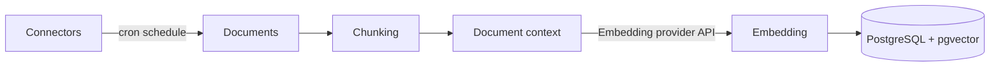
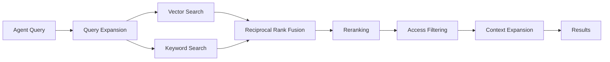
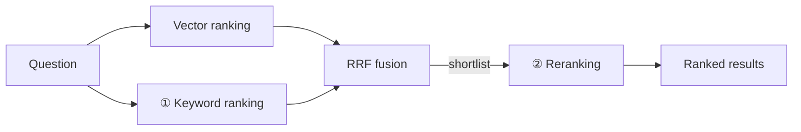

<!-- Renaming/deleting this file? Add a redirect in docs/redirects.json. -->

A Knowledge Base is a set of connectors that index your data for retrieval. Connectors pull from tools such as Jira, Confluence, GitHub, Notion, SharePoint, Google Drive, Salesforce, and M-Files. An agent assigned a Knowledge Base can query that data to answer questions.

> **Enterprise feature** (team-scoped access control) — see the [Pricing Model](/docs/platform-pricing-model).


## How Retrieval Works

The whole pipeline runs inside Archestra on PostgreSQL with pgvector. There is no external vector database and no separate retrieval service to operate.

### Indexing

Connectors run on a cron schedule. Each document goes through the same four steps.

1. **Extract.** Text is pulled from the source. Office documents and PDFs are read through format-specific extractors; PDF text comes from the document's text layer. A PDF without a text layer — a scan, for example — is skipped and counted in the sync run details. With a multimodal embedding model configured, images are embedded directly rather than described.
2. **Chunk.** The document is split into passages of roughly 512 tokens, on paragraph and sentence boundaries. Each chunk carries its document title and the document's metadata, so it can be matched on its own. Each passage can be split again into smaller chunks — see [Multi-Granularity Indexing](#multi-granularity-indexing).
3. **Add context.** Optionally, add document-wide or passage-specific context to each chunk before indexing it. See [Contextual Retrieval](#contextual-retrieval).
4. **Embed.** Each chunk is vectorized with the configured embedding model and stored alongside a keyword index of the same text.

A document whose content has not changed since the last sync is skipped, so a re-sync only pays for what actually changed.



### Querying

A search runs both a semantic and a keyword pass, then narrows the results.

1. **Expand the query.** The reranking model rewrites the question into a semantic phrasing and a set of keyword queries. This catches documents that use different words than the asker did. Identifiers, ticket numbers, and error codes are preserved verbatim.
2. **Search both ways.** Every query variant runs against the vector index and the keyword index in parallel.
3. **Fuse.** Results are merged with Reciprocal Rank Fusion, which favors chunks that rank well across several variants rather than one.
4. **Rerank.** The reranking model scores each surviving chunk against the original question and drops the irrelevant ones. See [Query Results Ranking](#query-results-ranking).
5. **Filter by access.** Chunks the asking user cannot read are removed. This applies to every result, at every stage.
6. **Widen.** The chunks either side of each hit are stitched back on, so a passage that starts mid-sentence arrives with its surroundings. See [Context Expansion](#context-expansion). A hit on a child chunk is widened to its own passage instead.



### Query Results Ranking

A short primer on the terms behind the settings, and how Archestra puts them together. Each search runs the stages below in order, and every stage is on by default except reranking.

- **RAG (retrieval-augmented generation).** The agent does not know your documents. For each question it retrieves the most relevant passages and answers from them. Retrieval quality caps answer quality — the ranking below decides what the agent gets to read.
- **Vector ranking (semantic search).** At sync, the embedding model turns every chunk into a vector. At query time the question is embedded the same way and chunks are ranked by how close their vectors are — close in meaning, even when the words differ. Configured under [Embedding Configuration](#embedding-configuration); pgvector does the arithmetic.
- **Keyword ranking.** Passages that contain the question's words are ranked by how well the words match. It catches what embeddings blur — an identifier, an error code, a product name. Fine-tuned under [Keyword Ranking](#keyword-ranking).
- **BM25.** The standard keyword scoring function, used by Lucene, Elasticsearch, and most search engines — and Archestra's keyword ranker. Rare words count more than common ones, a word that repeats earns less each time, and long passages are held back, so a short passage that answers directly beats a long one that merely repeats the words. Archestra computes it in plain SQL, so it runs on any PostgreSQL with no extension.
- **Hybrid search.** Vector and keyword ranking run together, each finding what the other misses: the meaning without the words, the words without the meaning. Archestra always runs both; `ARCHESTRA_KNOWLEDGE_BASE_HYBRID_SEARCH_ENABLED=false` drops the keyword leg.
- **Reciprocal Rank Fusion (RRF).** Vector and keyword scores are on different scales, so the two lists are merged by rank position, not score. A chunk near the top of both lists wins. Nothing to configure.
- **Cross-encoder reranking.** A model reads the question and one chunk together and scores that pair — more accurate than comparing vectors, and far more expensive, so it runs only on the fused shortlist. In Archestra the reranking model is a chat model, or a Cohere Rerank model (a purpose-built cross-encoder). Optional, configured under [Search Ranking Configuration](#search-ranking-configuration).

In order, a search is: question → [query expansion](#querying) → vector ranking and keyword ranking in parallel → RRF → reranking → [access filtering](#querying) → [context expansion](#context-expansion). Keyword ranking and reranking are two stages of one search, not alternatives: keyword ranking decides which chunks reach the shortlist, reranking decides the final order of that shortlist. Both live under **Settings > Knowledge > Search Ranking Configuration**, in that order.



Why it is set up this way: BM25 is simply better than PostgreSQL's built-in `ts_rank` at ordering keyword matches, so it is the keyword ranker rather than an option — computed without an extension so it works on managed PostgreSQL. Reranking is off until a model is chosen because it costs one model call per search.

#### Keyword Ranking

Step 1 of search ranking. Passages that contain the question's words are scored with BM25 and merged with the passages that match by meaning. There is nothing to set up. Two factors under **Settings > Knowledge > Search Ranking Configuration** fine-tune it — a change applies to the next search, and nothing is re-indexed. The defaults suit almost every knowledge base.

- **Term Saturation** (`k1`, 0–10, default 1.2) — how much repeating a word keeps helping a passage. Lower it when long, repetitive documents keep crowding out concise answers; raise it when the best passages genuinely use a term over and over.
- **Length Normalization** (`b`, 0–1, default 0.75) — how much long passages are held back. Lower it when long, detailed passages deserve an equal chance; raise it when short, focused passages should pull ahead.

Each field shows the deployment default until you change it; setting it back to the default returns it to following that default. The defaults come from `ARCHESTRA_KNOWLEDGE_BASE_BM25_K1` and `_B` — see [Deployment](/docs/platform-deployment#knowledge-base-configuration).

BM25 scores from statistics that Archestra rebuilds in the background — right after startup, then hourly. The statistics cover the whole deployment, not one organization. Until the first build, keyword matches rank with PostgreSQL's built-in full-text ranking. The Keyword ranking section shows where this stands: ready, still building — with when the next update runs — updating right now, nothing indexed yet, or the last update failed.

#### Reranking

Step 2 of search ranking. The reranking model reads each shortlisted chunk together with the question, scores it, reorders the list, and drops the chunks it finds irrelevant. A chunk that matched on words alone — the right terms in the wrong context — falls away here.

Reranking is optional. Without it, results come back in fused order. Query expansion and [contextual retrieval](#contextual-retrieval) use the same model, so they are off too. Reranking costs one model call per search, recorded in [LLM cost statistics](/docs/platform-llm-proxy) under "Knowledge - Reranker". Set it up under [Search Ranking Configuration](#search-ranking-configuration).

### Citations

Every result carries the document title, its URL in the source system, the connector it came from, and the position of the chunk within the document. An agent answering from a Knowledge Base cites those sources in its reply, so a reader can open the original.

In the built-in chat, the agent also marks each claim with a numbered reference and lists a short verbatim quote for each — tagged with the chunk it came from — in a Sources section at the end of the answer. Archestra checks each quote against the chunk it cites — a quote found in no returned chunk is logged as a likely fabrication. The check never blocks or alters an answer, and it covers the built-in chat only. Set `ARCHESTRA_KNOWLEDGE_BASE_QUOTE_VERIFICATION_ENABLED` to `false` to turn it off.

### Contextual Retrieval

Chunking separates a passage from the context it sits in. A chunk reading "the limit was raised to 5,000 per minute" is a poor match for "what is the rate limit on the billing API", because neither the product nor the subject appears in it.

Under **Settings > Knowledge > Search Ranking Configuration**, choose how context is generated:

- **Disabled** — index each chunk without generated context.
- **Per document — lower cost** — generate one document-wide context and index it with every chunk. This costs one model call per changed document.
- **Per passage — higher recall** — generate context specific to each chunk, so a passage can name its own section or subject instead of inheriting only a broad document summary. Longer documents are processed in batches of up to eight passages. Documents with fewer than six chunks use the lower-cost document mode because passage-specific calls rarely improve them enough to justify the extra spend.

The generated context shapes matching only — it is never added to the text the agent reads. Per-passage generation reuses a stable document prefix so providers that support prompt caching can discount later batches. Calls and cache-token costs appear in [LLM cost statistics](/docs/platform-llm-proxy) under "Knowledge - Contextual Retrieval".

Both enabled modes require a reranking model that can generate text. A dedicated Cohere Rerank model can only score results, so contextual retrieval is skipped with one configured. The deployment flag `ARCHESTRA_KNOWLEDGE_BASE_CONTEXTUAL_RETRIEVAL_ENABLED` sets the default for organizations that have not saved a mode; `true` means **Per document**.

### Context Expansion

Search ranks chunks, but a chunk boundary falls wherever the chunker put it. A hit can begin mid-sentence or cut a table in half.

After ranking, the neighbouring chunks are stitched back onto each hit. Ranking is unaffected — this only widens the passage the agent reads. Expansion stops at any chunk the user cannot read, so it never becomes a way around access control. Set the radius with `ARCHESTRA_KNOWLEDGE_BASE_CONTEXT_EXPANSION_RADIUS`.

### Multi-Granularity Indexing

One chunk size serves one kind of question. A chunk small enough that a port number stands out is too small to explain what the port belongs to. A chunk large enough to carry that explanation buries the port number among everything else in it.

Multi-granularity indexing splits each passage a second time, into smaller child chunks, and indexes only the children. A search matches a child, and the agent reads the whole passage that child came from. Precise lookups and broad questions are then served by the same corpus.

Set the child size with `ARCHESTRA_KNOWLEDGE_BASE_CHILD_CHUNK_SIZE_TOKENS`. It is off by default, and `0` turns it off.

Two consequences are worth knowing. Several children of one passage often match together, so only the best-ranked one is kept — a passage is never returned twice in one result set. And [context expansion](#context-expansion) does not apply to a hit served this way, because the passage around it has already been returned.

The cost lands on index size rather than on your embedding bill. The children cover the same text the passages did, so the tokens sent to the embedding model barely change — a measured 4% more on a sample document. What grows is the number of stored vectors, roughly the ratio of the two sizes. Contextual retrieval is unaffected: context is still generated once per passage.

Like chunk size, this applies at ingest. Documents already indexed keep their existing shape until their connector re-syncs, and both shapes are searched together in the meantime.

### Keyword Search Language

The keyword index stems words so that different forms of one word match. Stemming is language-specific: "Katzen" and "Katze" only collapse to the same term under German rules.

Set the language on each connector under **Advanced > Keyword Search Language**, to match the language its documents are written in. Choose **Simple** to turn stemming off, which suits source code and mixed-language sources. One deployment can index an English wiki and a German one correctly at the same time. The setting applies on the connector's next sync.

### Tuning

These settings are deployment-wide. See [Deployment](/docs/platform-deployment#knowledge-base-configuration) for the full reference.

| Setting | Default | Controls |
| --- | --- | --- |
| `ARCHESTRA_KNOWLEDGE_BASE_HYBRID_SEARCH_ENABLED` | `true` | Whether keyword search runs alongside vector search |
| `ARCHESTRA_KNOWLEDGE_BASE_CHUNK_SIZE_TOKENS` | `512` | Size of one chunk. Smaller is more precise, larger carries more context |
| `ARCHESTRA_KNOWLEDGE_BASE_CHILD_CHUNK_SIZE_TOKENS` | `0` | Size of one child chunk. `0` indexes passages only |
| `ARCHESTRA_KNOWLEDGE_BASE_CONTEXT_EXPANSION_RADIUS` | `1` | How many neighbouring chunks are stitched onto a hit |
| `ARCHESTRA_KNOWLEDGE_BASE_CONTEXTUAL_RETRIEVAL_ENABLED` | `false` | Default contextual retrieval mode for organizations without a saved choice (`true` = per document) |

Chunk sizes and contextual retrieval apply at ingest. A normal sync updates changed documents; force a connector re-sync to rebuild context for documents whose source content has not changed.

## Configuration

Open **Settings > Knowledge**. An embedding model must be set before Knowledge Bases can be used. Document OCR, a reranking model, and [contextual retrieval](#contextual-retrieval) are optional. Keyword ranking needs no setup, though two factors can be tuned — see [Keyword Ranking](#keyword-ranking).

### Embedding Configuration


Pick the API key and embedding model. The embedding model vectorizes ingested documents so they can be queried semantically. The same model is used for both indexing and querying, which is why it is locked once saved.

- **Key** — only keys whose synced models have configured embedding dimensions appear in this list. If yours is missing, go to **LLM Providers > Models**, sync the provider, and set the dimensions for the embedding model. Supported dimensions: 384, 768, 1024, 1408, 1536, 3072. Keys connected through a subscription sign-in (a SuperGrok login, for example) do not appear — Knowledge needs an API key.
- **Model** — any embedding-capable model exposed by the selected key.

To change the embedding model, click **Drop** to clear the existing index — every document will need to be re-embedded on the next connector sync. The lock also applies in **LLM Providers > Models**: the configured model's embedding dimensions and input modalities cannot be edited until the configuration is dropped.

### Image Embedding

Connectors index image files only when the configured embedding model accepts image input. These models do:

| Provider    | Model                                                                 | Image formats                |
| ----------- | --------------------------------------------------------------------- | ---------------------------- |
| Gemini      | `gemini-embedding-2`                                                  | PNG, JPEG                    |
| Gemini      | Multimodal Embedding (`multimodalembedding@001`, Vertex AI mode only)  | PNG, JPEG, BMP, GIF, WebP    |
| AWS Bedrock | Amazon Titan Multimodal Embeddings G1 (`amazon.titan-embed-image-v1`) | JPEG, PNG, WebP, GIF         |
| AWS Bedrock | Cohere Embed English v3 and Multilingual v3                           | JPEG, PNG, WebP, GIF         |
| Cohere      | Cohere Embed v4 (`embed-v4.0`)                                        | JPEG, PNG, WebP, GIF         |
| Cohere      | Cohere Embed English v3, Multilingual v3, and their Light variants    | JPEG, PNG, WebP, GIF         |

Archestra currently treats embedding models not listed above as text-only, even when their providers may offer multimodal variants that are not yet supported by the knowledge-base client. They cannot be marked as accepting image input in **LLM Providers > Models**. Connectors skip image formats the model does not accept — SVG, for example. Images ingested under an earlier configuration are skipped at embedding time. The document completes without them, and the run shows the skipped count.

Titan Multimodal G1 accepts 256 text tokens per input. Cohere Embed v3 accepts 512 text tokens per input — on Bedrock, 2048 characters. Longer text chunks are truncated before embedding — only the start of the chunk lands in the vector. Use a text embedding model, or Cohere Embed v4, when your corpus is mostly documents.

Vertex AI's `multimodalembedding@001` is available when [Vertex AI mode](/docs/platform-supported-llm-providers#using-vertex-ai) is enabled. It embeds at 1408 dimensions. Archestra trims text above the API's 1024-byte cap, then the model shortens text past 32 tokens internally. It also embeds one input per request under a per-project rate limit, which makes large document backfills slower than with `gemini-embedding-2`.

Cohere embedding models come from the Cohere key's model list in **LLM Providers > Models** with their dimensions preset — Embed v4 at 1536 (256, 512, or 1024 on request), v3 at 1024, and the Light variants at 384.

With a text-only embedding model, image files are skipped and the connector page says so. Scanned pages inside PDFs are a separate case: [Document OCR](#document-ocr) transcribes them whatever the embedding model is. It does not read standalone image files.

### Search Ranking Configuration


One card for both ranking stages — what each does is described under [Query Results Ranking](#query-results-ranking).

**Keyword ranking** is always on. Its two settings — Term Saturation and Length Normalization — are explained under [Keyword Ranking](#keyword-ranking); they show the defaults until you change them.

**Reranking** takes the model that scores and reorders search results by relevance. It is optional; without it, results come back in fused order.

- **Key** — any LLM provider API key. Subscription sign-ins do not appear here either.
- **Model** — any chat model from that provider. Cohere Rerank models are also supported, on Cohere keys and Azure AI Foundry keys, and are called through their native rerank API.

A chat model also powers query expansion and [contextual retrieval](#contextual-retrieval). A Cohere Rerank model only scores results, so both are skipped with one configured.

A chat reranker scores passages by returning a JSON object, so Archestra asks the endpoint to constrain the model's output to that shape. **Test connection** checks that it does. If the test reports that the model replied without a JSON object, the endpoint is not applying the constraint. Enable structured outputs on it — a self-hosted vLLM server needs this — or choose a model that supports them.

### Document OCR


A scanned PDF has no text layer, so connectors cannot index it — the run reports it under "No text extracted". Configure Document OCR and syncs transcribe those pages with a vision model instead. The text becomes searchable like any other document.

- **Key** — an API key on a provider that accepts PDF input: Anthropic, OpenAI, Gemini, Bedrock, Azure, OpenRouter, or vLLM.
- **Model** — a vision-capable model from that provider. Self-hosted models (a vLLM server, for example) sync without modality metadata: mark the model's image or PDF input modality in **LLM Providers > Models** to make it selectable. **Test connection** sends a synthetic PDF page to verify the pair works.

OCR runs only on pages that yielded no text. A mixed document — a contract with a scanned signature page, for example — keeps its digital text and gets the scanned pages transcribed. Each transcribed page is one metered model call, recorded in [LLM cost statistics](/docs/platform-llm-proxy) under "Knowledge - OCR". A single document is capped at `ARCHESTRA_KNOWLEDGE_BASE_OCR_MAX_PAGES_PER_DOCUMENT` pages (default 100); pages past the cap stay untranscribed and the run says so.

Saving the configuration for the first time resets every connector's sync checkpoint. The next sync re-reads all sources, so documents previously skipped as unreadable are picked up. A run also carries an overall transcription budget: a document whose pages did not fit is indexed with a warning naming what was left out, and its untranscribed pages are only revisited when the source modifies the document or after another full re-sync.

## Creating a Knowledge Base

A Knowledge Base is a set of connectors. Create one from the **Knowledge** page and assign connectors to get data from. The same Knowledge Base can be reused across multiple agents and MCP Gateways.

## Knowledge Files

Knowledge Files is a repository for documents you upload directly — a signed contract that arrived by email, for example. A connector pulls from a source system; here you bring the file yourself. Open **Knowledge > Files**.

Upload PDF, Word, Markdown, CSV, JSON, HTML or plain text. The text is read at upload, and a file that cannot be read is refused right there — so nothing lands in the repository that would retrieve nothing later. A scanned PDF is accepted when [Document OCR](#document-ocr) is configured; its pages are transcribed when the file is indexed.

Directories group documents and are flat — no sub-directories. Create one from **Files** or from the directory menu while uploading. Every document and directory has an audience: **Organization**, **Teams**, or **Only me**. Visibility follows the document into retrieval, so sharing a Knowledge Base with an agent does not widen who can read what is inside it.

Uploading stores a document; indexing makes it retrievable. Select documents or whole directories, choose **Add to knowledge base**, and pick an existing base or create one from the selection.

A file attached to a chat belongs to that conversation. To keep it, save it to the repository — from the attachment in the message, or from the Files panel, where you can select several at once. You choose the name, directory and visibility as you save, and can index it in one step.

### Chat, Project, and Knowledge Files

Files live in three places, and each answers a different need.

|                   | Chat attachments | Project files | Knowledge Files |
| ----------------- | ---------------- | ------------- | --------------- |
| Scope             | One conversation | Every chat in the project | The whole organization |
| Who can read them | You              | Everyone in the project | The audience you set — organization, teams, or only you |
| How agents use them | Sent to the model with your message | Read on demand by any chat in the project | Retrieved from a Knowledge Base, with citations |
| Use them for      | A one-off question about a file | Working files for one piece of work | Reference documents agents should answer from |

A file can move up this ladder: save a chat attachment to the repository, then index it into a Knowledge Base.

### Use Case: Vendor Security Reviews

A security analyst reviews vendor documents that arrive by email.

1. Upload the questionnaires and SOC 2 reports into a **Vendor contracts** directory, scoped to the security team.
2. Select the directory and add it to a **Vendor security review** Knowledge Base.
3. Assign that base to the review agent.
4. Ask the agent which vendors store customer data outside the EU. Every answer cites the document it came from.

## Assigning to an Agent

An agent — or an [MCP Gateway](/docs/platform-mcp-gateway) — reaches knowledge through the **Tools & Knowledge Sources** setting in its dialog, which has two modes:

- **Auto** — the agent can search every Knowledge Base and connector the chatting user can access, within the agent's environment. Nothing is assigned; the reachable set follows each user's own visibility.
- **Custom** — the agent searches only the Knowledge Bases and connectors you assign to it. Pick them under **Knowledge sources**; the picker stays disabled until an embedding model is set (see [Configuration](#configuration)).

Either mode is still filtered by the chatting user's own visibility, so an agent never surfaces a source the user could not read themselves. Once the agent has at least one reachable source, it gains a `query_knowledge_sources` tool that searches across them and returns the most relevant documents.

The output of `query_knowledge_sources` is treated as sensitive by default, which can impact the ability to use subsequent tools. See [Archestra MCP Server](/docs/platform-archestra-mcp-server#auth), and [AI Tool Guardrails](/docs/platform-ai-tool-guardrails), for more details.


Connectors pull data from external tools into Knowledge Bases. A connector can be assigned to multiple Knowledge Bases.

## Narrowing a Search

A search covers every document in the sources an agent can reach. Some questions only concern a slice of that — the docs for the current release, for example.

`query_knowledge_sources` takes an optional `documentFilter` for this. It matches documents on the metadata their connector supplied, such as `spaceKey`, `labels`, `repo`, or `state`.

Keys are combined with AND. Several values for one key are combined with OR.

```json
{
  "query": "how do we roll back a deploy?",
  "documentFilter": { "spaceKey": "DEV", "labels": ["release-2.0"] }
}
```

That searches only pages in the DEV space labelled `release-2.0`. One agent can answer for the current release and another for the archive, from the same connector.

A filter reads single values and lists the same way. Confluence stores one `spaceKey` per page and many `labels`, and the syntax above matches both.

Filtering never widens access. [Visibility](#visibility) is applied separately, so a filter only ever removes documents from what you could already read.

If a filter matches nothing, the reply names the values that do exist for the keys you used. The agent retries with a real one instead of reporting that it found nothing.

Tell the agent which slice to search in your instructions or your question. It filters when a request names a subset, not when it guesses one from the topic.

## Sync Runs

Open a connector to review its document sync runs and progress. You can cancel a running document sync from its **Actions** column. Cancellation stops new source batches and keeps documents already ingested by the run. A later sync continues from the saved connector checkpoint.

Open a run's details to review warnings and connector errors. The logs name documents whose content exceeded an indexing limit. Unsupported file types are counted as skipped. A document that produces no chunks finishes with an error.

## Visibility

Each connector has a visibility setting that determines which users can retrieve its data when an agent calls `query_knowledge_sources`. Connectors and Knowledge Bases are filtered by visibility throughout the UI: users only see sources they have access to, and only those can be assigned to agents and MCP Gateways.

| Mode                      | Behavior                                                                          |
| ------------------------- | --------------------------------------------------------------------------------- |
| **Org-wide**              | All documents accessible to every user in the organization.                       |
| **Team-scoped**           | Documents accessible only to members of the assigned teams.                       |
| **Auto-sync permissions** | Per-document ACLs synced from the source system, so each user sees only what they can see upstream. See [Auto-Sync Permissions](#auto-sync-permissions). |

Users with `knowledgeSource:admin` bypass document ACLs while querying. This permission does not grant access to manage auto-sync connectors.

Auto-sync connectors use dedicated `knowledgeSourceAutoSync` permissions for read, create, update, and delete actions. Admin and Platform Admin roles receive all four actions by default. Grant them to other users through a [custom role](/docs/platform-access-control). Users without these management actions can still query documents allowed by the synced ACLs.

> **Enterprise feature** (team-scoped visibility and auto-synced ACLs) — see the [Pricing Model](/docs/platform-pricing-model).

### Auto-Sync Permissions

> **Beta feature** — off by default. Set `ARCHESTRA_KNOWLEDGE_BASE_AUTO_SYNC_PERMISSIONS_ENABLED=true` (or the `ARCHESTRA_BETA` master switch) to show the visibility option and its Users and Groups tabs. See [Deployment](/docs/platform-deployment).

Auto-sync permissions mirrors the source system's access control into Archestra. Each query returns only documents allowed by the latest permission snapshot. Users with `knowledgeSource:admin` bypass this filter.

The option appears when the beta flag and Knowledge enterprise feature are enabled. It also requires a supported connector and the applicable `knowledgeSourceAutoSync:create` or `update` action.

Auto-sync permissions works with the connectors marked *Supported* below. *Limited* means the source's access control is mirrored with a coarser audience model — the row says which. The others do not support it yet.

| Connector    | Auto-sync permissions                                                                                     |
| ------------ | --------------------------------------------------------------------------------------------------------- |
| Asana        | Supported ([setup](#asana-auto-sync-permissions))                                                         |
| Confluence   | Supported ([setup](#confluence-auto-sync-permissions))                                                    |
| Dropbox      | Limited: stored access tokens cannot refresh ([details](#dropbox-auto-sync-permissions))                  |
| GitHub       | Supported ([setup](#github-auto-sync-permissions))                                                        |
| GitLab       | Supported ([setup](#gitlab-auto-sync-permissions))                                                        |
| Google Drive | Limited by authentication mode ([details](#google-drive-auto-sync-permissions))                            |
| Jira         | Jira Cloud only; issue security unsupported ([details](#jira-auto-sync-permissions))                      |
| Linear       | Supported ([setup](#linear-auto-sync-permissions))                                                        |
| M-Files      | Supported with the VAF Add On ([setup](#m-files-auto-sync-permissions))                                   |
| Notion       | Limited: every synced page is visible to all workspace members ([details](#notion-auto-sync-permissions)) |
| OneDrive     | Supported ([setup](#onedrive-auto-sync-permissions))                                                      |
| Outline      | Supported ([setup](#outline-auto-sync-permissions))                                                       |
| Perforce     | Supported with the Kubernetes orchestrator ([setup](#perforce-auto-sync-permissions))                     |
| Salesforce   | Supported ([setup](#salesforce-auto-sync-permissions))                                                    |
| ServiceNow   | Supported ([setup](#servicenow-auto-sync-permissions))                                                    |
| SharePoint   | Supported ([setup](#sharepoint-auto-sync-permissions))                                                    |
| Web Crawler  | Not supported                                                                                             |

#### Credentials and Email Resolution

Permission sync uses the connector's upstream identity. That identity must read both content and its permission settings. Unreadable permission data fails closed, so the affected documents grant no access.

External accounts match Archestra users by email. A hidden or empty email leaves that account unassigned and removes it from resolved audiences. Accounts listed under **Users** can be assigned manually. An empty group roster must be fixed upstream because manual assignment cannot add members to it.

Each connector section lists its credential type, required scopes, and upstream setup. Use a dedicated identity whose visibility covers every configured source. **Test connection** validates authentication, but a successful test cannot prove access to every project or permission table.

**Editing a connector.** Saving new settings or credentials stops the permission sync running against the old ones — that run ends as **Superseded**. A replacement run starts straight away, so you don't wait for the next scheduled one.

#### Atlassian Organization Admin API Key

An organization admin API key reads managed accounts' emails through the Atlassian admin APIs. Add it to a Jira or Confluence Cloud connector. Permission sync can then resolve managed users whose profile email is private.

Create the key in [Atlassian administration](https://admin.atlassian.com) under **Settings → API keys**:

1. Select **Create API key** and name it.
2. Leave the key **without scopes**. Permission sync calls the classic admin APIs, which scopes do not cover.
3. Copy the key into the connector's **Organization admin API key** field.

The API token stays required. Atlassian does not accept admin API keys on the Jira and Confluence APIs.

Changing **Cloud Instance** on an existing Jira or Confluence connector changes its authentication method, so re-enter the token or password. Switching to Cloud also requires the Atlassian account email. Switching away from Cloud removes the stored organization admin key. For Server or Data Center, leave **Username** empty while entering a new personal access token to select PAT authentication; re-enter the username when changing a Basic-auth password.

## Deleting and Restoring Knowledge Bases and Connectors

Deleting a knowledge base or connector moves it to a trash — the record is hidden but kept. Deleting a knowledge base leaves its connectors alone: they are unlinked from it, but they are not deleted and keep syncing. Deleting a connector does stop its syncs, and destroys its stored credential.

Anyone with `knowledgeSource:delete` switches the status filter to **Deleted** to open the trash. **Restore** returns the entry to active. A restored knowledge base is immediately live for its previously-assigned agents. A restored connector comes back disabled — re-authenticate it, then enable it to resume syncing.

Global admins can also delete an entry from the trash for good, with **Delete permanently**. For a knowledge base this destroys the record and its agent and connector assignments; its connectors survive. For a connector it destroys every document it has indexed, along with its run history and access mappings. Nothing brings either back.

## Supported Connectors

Archestra ships with these built-in connector types. Go to **Settings → Knowledge → Available connectors** to remove any your organization does not allow. A connector type you remove disappears from the pickers, and the API refuses to configure it. Connectors that already exist keep syncing until you delete them.

A sync that indexes nothing, on a connector that holds nothing, finishes as **No documents** rather than a success. The run names the likely cause -- content that was never shared with the credential, a folder that identity cannot see, or a file-type filter that excludes everything. A later sync that finds no changes is an ordinary success.

### Jira

Sync issues and discussions from Atlassian Jira.

**Indexed:** issue descriptions, comments, and metadata from Jira Cloud or Server.

**Authentication:** Jira Cloud uses an Atlassian account email and API token. Jira Server and Data Center use a personal access token with the Username field empty. On releases without personal access tokens, enter the account username and password for Basic authentication.

| Field                   | Description                                                        |
| ----------------------- | ------------------------------------------------------------------ |
| Base URL                | Your Jira instance URL (e.g., `https://your-domain.atlassian.net`) |
| Cloud Instance          | Toggle on for Jira Cloud, off for Jira Server/Data Center          |
| Project Keys            | Comma-separated project keys to include (optional)                 |
| JQL Query               | Custom JQL to filter issues (optional)                             |
| Comment Email Blacklist | Comma-separated emails whose comments are excluded (optional)      |
| Labels to Skip          | Comma-separated issue labels to exclude (optional)                 |

#### Jira Auto-Sync Permissions

For Jira Cloud, use a dedicated Jira administrator:

1. Create an API token from [Atlassian account security](https://id.atlassian.com/manage-profile/security/api-tokens). Choose an unscoped token for the connector's site URL.
2. Grant the account **Administer Jira** and **Browse users and groups** global permissions.
3. Grant **Browse Projects** on every synced project. Add the account to every issue-security level whose issues it must index.
4. Create a separate [organization admin API key](#atlassian-organization-admin-api-key) to resolve private managed-account emails.

The product API token reads Jira data. The organization key reads managed-account profiles only. External accounts still need public profile emails or [manual assignment](#credentials-and-email-resolution).

Jira Server and Data Center content sync remains supported, but auto-sync permissions is not. Its permission APIs differ from Jira Cloud, and Jira exposes no equivalent REST API for issue-security membership. Personal access tokens require Jira Core or Software 8.14+, or Jira Service Management 4.15+. On older releases, enter the username in **Username** and the password in **API Token / Personal Access Token** to use Basic authentication.

Do not enable auto-sync permissions for Jira Cloud projects that use issue security. Jira requires both **Browse Projects** and issue-security membership, but the connector cannot currently enforce that intersection. Browse Projects grants through Project Lead or user/group custom fields, and dynamic issue-security holders such as Reporter and Assignee, are also unsupported.

### Confluence

Sync wiki pages from Atlassian Confluence.

**Indexed:** pages from Confluence Cloud or Server.

**Authentication:** Confluence Cloud uses an Atlassian account email and API token. Confluence Server and Data Center 7.9+ use a personal access token with the Username field empty. On older releases, enter the account username and password for Basic authentication.

| Field          | Description                                                                   |
| -------------- | ----------------------------------------------------------------------------- |
| URL            | Your Confluence site root (e.g., `https://your-domain.atlassian.net`)         |
| Cloud Instance | Toggle on for Confluence Cloud, off for Server/Data Center                    |
| Space Keys     | Comma-separated space keys to sync (optional)                                 |
| Page IDs       | Comma-separated specific page IDs to sync (optional)                          |
| CQL Query      | Custom CQL to filter content (optional)                                       |
| Labels to Skip | Comma-separated labels to exclude (optional)                                  |
| Batch Size     | Pages per batch (default: 50)                                                 |

#### Confluence Auto-Sync Permissions

For Confluence Cloud, use a dedicated account with product access:

1. Create an unscoped API token from [Atlassian account security](https://id.atlassian.com/manage-profile/security/api-tokens).
2. Enter the site root, such as `https://example.atlassian.net`, without `/wiki`.
3. Grant **View** on every synced space. Add the account to every page and ancestor restriction it must index.
4. Grant **Confluence Administrator** when audit-based incremental permission reads are required.
5. Create a separate [organization admin API key](#atlassian-organization-admin-api-key) to resolve private managed-account emails.

A Cloud administrator does not automatically bypass page restrictions through the API. Unreadable pages never enter the index.

For Confluence Server or Data Center 7.9+, create a token under **Profile > Personal access tokens** and leave **Username** empty. On older releases, enter the username in **Username** and the password in **API Token / Personal Access Token**. Membership in the `confluence-administrators` group provides the broadest space and restricted-page visibility.

### GitHub

Sync issues, pull request discussions, and repository files from GitHub.

**Indexed:** issues, pull requests, comments, and selected text files from GitHub.com or GitHub Enterprise Server. Repository file indexing defaults to Markdown and YAML files.

**Authentication:** a [personal access token](https://docs.github.com/en/authentication/keeping-your-account-and-data-secure/managing-your-personal-access-tokens) or a GitHub App. GitHub App credentials (App ID, installation ID, and private key) are stored once as an organization-level configuration under **Settings -> GitHub**; the connector references a saved configuration instead of holding its own credentials, so one App can back many connectors and skill imports.

| Field                 | Description                                                                                     |
| --------------------- | ----------------------------------------------------------------------------------------------- |
| GitHub API URL        | API endpoint (e.g., `https://api.github.com` for GitHub.com, or your GHE API URL)               |
| Owner                 | GitHub organization or username that owns the repositories                                      |
| Authentication Method | Personal access token or GitHub App                                                            |
| GitHub App Configuration | Saved configuration to authenticate with when using GitHub App auth (managed in **Settings -> GitHub**) |
| Repositories          | Comma-separated repository names to sync (optional -- leave blank to sync all org repositories) |
| Include Issues        | Toggle to sync issues and their comments (default: on)                                          |
| Include Pull Requests | Toggle to sync pull requests and their comments (default: on)                                   |
| Include Repository Files | Toggle to sync repository files (default: off)                                               |
| File Types            | Comma-separated file extensions to index when repository files are enabled (defaults to `.md`, `.mdx`, `.yaml`, `.yml`) |
| Folders               | Comma-separated folders to index, relative to the repository root (optional -- leave blank to index the whole repository) |
| Labels to Skip        | Comma-separated labels to exclude (optional)                                                    |

#### GitHub Auto-Sync Permissions

A GitHub App is the preferred credential. Create one under **Settings > Developer settings > GitHub Apps** with these read-only permissions:

| Permission type | Read permission |
| --- | --- |
| Repository | Administration, Issues, Pull requests, and Metadata |
| Repository, when files are indexed | Contents |
| Organization | Members |

Install the App on every target repository. Generate a private key and copy its PEM value. Save the App ID, installation ID, API URL, and private key under **Settings > GitHub**, then select that configuration in the connector.

A fine-grained personal access token needs the same repository and organization permissions. Select every target repository. Its owner also needs write, maintain, or admin access to list collaborators. A classic token needs `repo` and `read:org`; authorize it for SAML SSO when the organization requires SSO.

GitHub exposes only each user's public profile email. No App or token permission reveals a private email, so those users need [manual assignment](#credentials-and-email-resolution).

### GitLab

Sync issues and merge request discussions from GitLab.

**Indexed:** issues, merge requests, their comments, and (optionally) Markdown files from GitLab.com or self-hosted GitLab instances. System-generated notes (assignment changes, label updates, etc.) are filtered out.

**Authentication:** a [personal access token](https://docs.gitlab.com/user/profile/personal_access_tokens/).

| Field                  | Description                                                                        |
| ---------------------- | ---------------------------------------------------------------------------------- |
| GitLab URL             | Instance URL (e.g., `https://gitlab.com` or your self-hosted URL)                  |
| Group                  | GitLab group ID or path to scope project discovery (optional)                      |
| Project IDs            | Comma-separated specific project IDs to sync (optional -- leave blank to sync all) |
| Include Issues         | Toggle to sync issues and their comments (default: on)                             |
| Include Merge Requests | Toggle to sync merge requests and their comments (default: on)                     |
| Include Markdown Files | Toggle to sync `.md` and `.mdx` files from the repository (default: off)           |
| Labels to Skip         | Comma-separated labels to exclude (optional)                                       |

#### GitLab Auto-Sync Permissions

Create a personal access token under **Edit profile > Access > Personal access tokens**. Grant only the `read_api` scope and set an expiry. The token's user needs **Reporter** or higher on every private project. Use an **Owner** of the configured top-level group for broad project discovery.

A regular token receives only `public_email`. On self-managed GitLab, an instance administrator token can read private email. Add `admin_mode` when Admin Mode is enabled. GitLab.com users without public email need [manual assignment](#credentials-and-email-resolution).

Each project is one permission scope. Its audience is the project's members with the **Reporter** role or higher — direct members, members inherited from ancestor groups, and members of invited groups, each at their effective access level. Guests are excluded: GitLab does not let them read code or confidential issues, so including them would over-share. **Public** and **internal** projects are readable by everyone in your Archestra organization.

Each sync snapshots one member roster per project, shown in the connector's **Users** and **Groups** tabs as `<project path> members`. A member whose email is hidden upstream stays unresolvable — assign them to an Archestra user from the Users tab, or ask them to set a public email on their GitLab profile.

### Asana

Sync tasks and discussions from Asana projects.

**Indexed:** tasks and their user comments from selected Asana projects.

**Authentication:** a [personal access token](https://developers.asana.com/docs/personal-access-token).

| Field         | Description                                                                                   |
| ------------- | --------------------------------------------------------------------------------------------- |
| Workspace GID | Your Asana workspace GID (found in the URL when viewing your workspace)                       |
| Project GIDs  | Comma-separated project GIDs to sync (optional -- leave blank to sync all workspace projects) |
| Tags to Skip  | Comma-separated tag names to exclude (optional)                                               |

#### Asana Auto-Sync Permissions

Create a token in the [Asana Developer Console](https://app.asana.com/0/my-apps). Personal access tokens have no selectable scopes and inherit the user's visibility. Add that user to every private project and team the connector syncs.

Asana Enterprise organizations can use a service account instead. A super admin creates it under **Admin console > Apps > Service accounts**. Grant **Full Permissions**, because standard task and membership APIs require that level.

Both credentials expose workspace-member emails. A missing email still needs [manual assignment](#credentials-and-email-resolution).

Each project is one permission scope. A project shared with the whole workspace grants every workspace member — guests excluded. Any other project grants its explicit members: users directly, teams through their team rosters. A task in several projects is readable through any of them; its scope is the union of those audiences. Task collaborators are granted individually on their tasks.

Each permission sync also snapshots workspace members and team rosters — the connector's **Users** and **Groups** tabs show every member with their assignment status, and an account whose email is hidden upstream can be assigned manually from the Users tab. Users added to a project directly — guests included — appear there too, under the synthetic **Direct project members** group. Limited-access team members get only the projects they are explicitly added to. Guests get only explicit project and task grants.

Permission reads run as the token's user. A project or roster the token cannot read stays fail-closed — use a token from a user who can see every synced project. A task removed from every synced project is hidden until a sync sees it again.

### ServiceNow

Sync ITSM records from a ServiceNow instance.

**Indexed:** incidents, change requests, change tasks, problems, business applications, and published knowledge articles. Incidents are enabled by default; the rest are opt-in.

**Authentication:** the connector form uses basic auth. Create a dedicated user under **User Administration > Users**, enable **Web service access only**, and set a password. API-created connectors can instead leave Email empty and store a pre-issued OAuth bearer token in the API Token field; the connector does not refresh that token.

**Required roles.** Use a dedicated service account ("Web service access only" is fine). The account needs roles that can read every synced table:

| Role | Grants read on |
| --- | --- |
| `itil` | Incidents, changes, change tasks, problems, and business applications |
| `knowledge` | Knowledge articles |
| `user_criteria_admin`, `user_admin` | User criteria definitions and the user, group, and role tables auto-sync reads |

The Can Read / Cannot Read criteria mappings (`kb_uc_can_read_mtom`, `kb_uc_cannot_read_mtom`) have no role-based read access out of the box — built-in roles such as `knowledge_admin` do not open them. Auto-sync permissions needs explicit access control lists (ACLs) on both tables.

Creating ACLs requires the `security_admin` role. ServiceNow grants it by elevation for the current session, and hides the **New** button on the ACL list until you elevate: open the profile menu, select **Elevate role**, and check **security_admin**. Then:

1. Go to **System Security → Access Control (ACL)** and select **New**. Set Type `record`, Operation `read`, and Name `kb_uc_can_read_mtom` with the field left as `--None--`. Under **Requires role**, add a role the service account holds. Submit.
2. Create a second ACL for the same table with the field set to `*`, which grants read on its fields.
3. Repeat both ACLs for `kb_uc_cannot_read_mtom`.

An account without the right roles fails in one of two ways, depending on the instance's ACLs: the sync errors with HTTP 403 "Insufficient rights to query records", or ServiceNow silently filters the rows and the sync succeeds with nothing ingested. Test the account directly before connecting: `curl -u '<user>:<password>' 'https://<instance>.service-now.com/api/now/table/incident?sysparm_limit=1'` should return a record, not an error and not an empty result.

| Field                         | Description                                                                                                                   |
| ----------------------------- | ----------------------------------------------------------------------------------------------------------------------------- |
| Instance URL                  | Your ServiceNow instance URL (e.g., `https://your-instance.service-now.com`)                                                  |
| Include Incidents             | Sync incidents from the `incident` table (default: on)                                                                        |
| Include Changes               | Sync change requests from the `change_request` table (default: off)                                                           |
| Include Change Tasks          | Sync change tasks from the `change_task` table (default: off)                                                                 |
| Include Problems              | Sync problems from the `problem` table (default: off)                                                                         |
| Include Business Applications | Sync business applications from the `cmdb_ci_business_app` CMDB table (default: off)                                          |
| Include Knowledge Articles    | Sync published knowledge articles from the `kb_knowledge` table (default: off)                                                |
| Role audiences                | Per-table ServiceNow role names for auto-sync permissions — see below (optional)                                              |
| States                        | Comma-separated state values to filter by (e.g. `1, 2`). Applies to incidents, changes, change tasks, and problems (optional) |
| Assignment Groups             | Comma-separated assignment group sys_ids to filter by. Does not apply to business applications (optional)                     |
| Batch Size                    | Records per batch (default: 50)                                                                                               |

#### ServiceNow Auto-Sync Permissions

ServiceNow decides record access with ACL rules, and those rules cannot be read through its REST API. For ITSM records and business applications, the connector grants each record to its participants instead: assignment group members plus the referenced users — the caller, the opener, and the assignee. Custom ACL conditions can make this audience differ from ServiceNow. To widen a table's audience, add role names under **Role audiences** (`itil`, for example) only when every holder can read every synced record in that table.

Knowledge articles follow ServiceNow's own permission model: **Can Read** and **Cannot Read** user criteria at knowledge-base and article level. The connector expands each criteria to its users, groups, roles, companies, departments, and locations. Script-based (advanced) criteria cannot be evaluated over the API: on an allow path they grant nobody; on a deny path the affected knowledge base or article is hidden from everyone. A knowledge base without criteria follows the instance's `glide.knowman.block_access_with_no_user_criteria` property — open to your whole Archestra organization when `false`, hidden when `true` or unreadable.

**Required access.** The connector account needs read access to these tables:

| Tables | Used for |
| --- | --- |
| `incident`, `change_request`, `change_task`, `problem`, `cmdb_ci_business_app`, `kb_knowledge` | Content sync of the enabled entities. Reading the ITSM tables needs the `itil` role on most instances |
| `sys_user`, `sys_user_group`, `sys_user_grmember`, `sys_user_has_role` | Resolving participants, group rosters, and role audiences to user emails |
| `user_criteria`, `kb_uc_can_read_mtom`, `kb_uc_cannot_read_mtom`, `sys_properties` | Knowledge-article audiences |
| `core_company`, `cmn_department`, `cmn_location` | Expanding criteria that reference them |

The [Required roles](#servicenow) section above covers these, including the explicit ACLs the criteria mapping tables need.

**Misconfiguration behaves silently.** ServiceNow filters out rows an account cannot read instead of returning an error. An under-privileged account therefore looks like missing data: content sync ingests nothing from a table it cannot read, and a permission table it cannot read makes the affected audiences fail closed — the documents exist but nobody can retrieve them. Each permission sync run reports how many audiences it could not read, so check the run details when documents seem to be missing or hidden. Knowledge bases in the HR Service Delivery scope (`sn_hr_core`) additionally need the `sn_hr_core.content_reader` role; without it their criteria read as empty and the articles fail closed.

Users granted directly on records appear in the connector's **Users** tab under the synthetic `direct-grants` group. A user whose `sys_user` email is empty stays unresolvable; assign such an account manually from the Users tab.

### Notion

Sync pages and databases from a Notion workspace.

**Indexed:** pages from a Notion workspace.

**Authentication:** an internal connection's installation access token. A Workspace Owner creates the connection in the [Notion Developer portal](https://app.notion.com/developers/connections) and copies the token from its **Configuration** tab.

| Field        | Description                                                                                        |
| ------------ | -------------------------------------------------------------------------------------------------- |
| Database IDs | Comma-separated Notion database IDs to sync (optional -- leave blank to sync all accessible pages) |
| Page IDs     | Comma-separated specific Notion page IDs to sync (optional -- takes precedence over Database IDs)  |

#### Notion Auto-Sync Permissions

Create the credential in the [Notion Developer portal](https://app.notion.com/developers/connections):

1. As a Workspace Owner, create an internal connection in the target workspace.
2. Enable **Read content** and **User information with email addresses** capabilities.
3. Copy the installation access token into **Integration Token**.
4. Under **Content access**, connect every page or database root to sync. Access flows to child pages.

Support is *Limited*. Notion's API does not say who can see a page — there is no sharing endpoint, and teamspaces are not exposed. Archestra cannot mirror per-page access, so every synced page shares one workspace-wide audience:

- A synced page is visible to every workspace member whose Notion email matches an Archestra user's email.
- Each permission sync refreshes the member roster from Notion's users API. The connector page shows a **Workspaces** tab in place of Groups, with one row per connector: the workspace, named as it is in Notion.
- Guests are never in Notion's member listing, so a guest never gains access through Archestra.
- Member emails need the integration capability **"read user information including email addresses"** (integration settings, **Capabilities** tab). A member without a readable email stays unresolvable (fail-closed) until you assign them from the Users tab.

A page that is private or teamspace-restricted in Notion, but shared with the integration, becomes readable by every workspace member through Archestra. Set up the integration's access with that in mind:

- Share only workspace-appropriate content with the integration — a company wiki teamspace, for example.
- Do not share private pages or restricted teamspaces with the integration.
- For content that must reach a narrower audience, use a separate connector with **Team-scoped** visibility.

This is still stricter than an org-wide connector: access stops at the workspace member roster instead of your whole Archestra organization, and it updates as members join and leave.

### SharePoint

Sync documents and site pages from SharePoint Online.

**Indexed:** documents and site pages from SharePoint Online. Supported document types include `.txt`, `.md`, `.csv`, `.json`, `.xml`, `.html`, `.htm`, `.yaml`, `.log`, `.docx`, `.pdf`, and `.pptx`. When a multimodal embedding model is configured, image files (`.jpg`, `.jpeg`, `.png`, `.gif`, `.webp`) up to 4 MB are also indexed.

**Authentication:** an Azure AD app registration with client credentials (OAuth2). The app needs the `Sites.Read.All` application permission on Microsoft Graph, with admin consent granted.

| Field         | Description                                                                                       |
| ------------- | ------------------------------------------------------------------------------------------------- |
| Tenant ID     | Your Azure AD (Entra ID) tenant ID or domain                                                      |
| Site URL      | Your SharePoint site URL (e.g., `https://your-tenant.sharepoint.com/sites/your-site`)             |
| Client ID     | Azure AD app registration Application (client) ID                                                 |
| Client Secret | Azure AD app registration client secret value                                                     |
| Drive IDs     | Comma-separated document library IDs to sync (optional -- leave blank to sync all site libraries) |
| Folder Path   | Restrict sync to a specific folder path within each drive (optional)                              |
| Recursive     | Traverse subfolders within each drive or Folder Path (default: on)                                |
| Include Pages | Toggle to sync site pages and their web part content (default: on)                                |

Where to find each value:

- **Tenant ID** — **Microsoft Entra ID > App registrations > <your app> > Overview > Directory (tenant) ID**.
- **Client ID** — Application (client) ID on the same page.
- **Client Secret** — the secret **Value** from **Certificates & secrets** (not the secret ID).
- **Site URL** — the exact SharePoint site web URL, not the display name.

#### SharePoint Auto-Sync Permissions

Create one single-tenant application under **Microsoft Entra ID > App registrations**. Add a client secret under **Certificates & secrets**, then copy its **Value**. Under **API permissions**, add the application permissions below and select **Grant admin consent**:

| API | Application permission | Purpose |
| --- | --- | --- |
| Microsoft Graph | `Sites.Read.All` | Site content, libraries, items, and permission lists |
| Microsoft Graph | `User.Read.All` | User grants, emails, and organization-link audiences |
| Microsoft Graph | `GroupMember.Read.All` | Microsoft 365 and Entra group rosters |
| Microsoft Graph | `Sites.FullControl.All` | Sharing-aware delta permission scans |

Each document library is one permission scope, and an item (file or folder) that breaks permission inheritance becomes its own scope — a document inherits its nearest such ancestor. Site pages follow the site's default library audience; per-page unique sharing is not modeled. Anonymous sharing links map to everyone in your Archestra organization; "people in your organization" links expand to the tenant's active users.

Microsoft 365 and Entra group grants carry the group's identity, and each permission sync snapshots their member rosters. Direct grantees appear under the synthetic `direct-grants` group. A group granted only on a single item is not discovered by roster sync. Its grant remains fail-closed until that group also appears on a library root.

SharePoint site groups are not currently expandable. The connector accepts a client secret, while SharePoint Online requires certificate authentication for app-only REST calls. Site-group grants remain fail-closed until certificate credentials are supported.

`Sites.Read.All` covers library and item grants. Extra permissions unlock more, progressively:

| Extra permission | Unlocks |
| ---------------- | ------- |
| `User.Read.All` | User grants expand to emails, and organization-wide links expand to the tenant's active users. |
| `GroupMember.Read.All` | Microsoft 365 / Entra group member rosters (the Users and Groups tabs, and group-based document access). |
| Microsoft Graph `Sites.FullControl.All` | Permission sync switches to cheaper sharing-aware delta runs. |

Each tier is detected at runtime: without it, that kind of grant or roster drops (fail-closed) and the rest of the sync proceeds.

### OneDrive

Ingests files from OneDrive for Business (personal drives of specified users) via the Microsoft Graph API. Text is extracted from `.txt`, `.md`, `.csv`, `.json`, `.xml`, `.html`, `.htm`, `.yaml`, `.log` files, as well as `.docx`, `.pdf`, and `.pptx` documents. When a multimodal embedding model is configured (see [Image Embedding](#image-embedding)), image files (`.jpg`, `.jpeg`, `.png`, `.gif`, `.webp`) up to 4 MB are also ingested and embedded directly.

| Field         | Description                                                                                                          |
| ------------- | -------------------------------------------------------------------------------------------------------------------- |
| Tenant ID     | Your Azure AD (Entra ID) tenant ID or domain (e.g., `xxxxxxxx-xxxx-xxxx-xxxx-xxxxxxxxxxxx`)                        |
| Client ID     | Azure AD app registration Application (client) ID                                                                    |
| Client Secret | Azure AD app registration client secret value                                                                        |
| User IDs      | Comma-separated list of user principal names or object IDs whose OneDrive to sync (e.g., `user@company.com`)       |
| Folder ID     | Restrict sync to a specific OneDrive folder (optional -- find the ID from the Graph API or a drive item URL)         |
| File Types    | Comma-separated file extensions to include, e.g. `.pdf, .docx` (optional -- leave blank for all supported types)  |
| Recursive     | Traverse subfolders within each user's drive (default: on)                                                          |

Authentication uses an Azure AD app registration with client credentials (OAuth2). The app registration requires the `Files.Read.All` application permission on Microsoft Graph, and admin consent must be granted.

To configure the connector:

- `Tenant ID` comes from **Microsoft Entra ID > App registrations > <your app> > Overview > Directory (tenant) ID**
- `Client ID` comes from **Application (client) ID** on the same page
- `Client Secret` is the secret **Value** from **Certificates & secrets**, not the secret ID
- `User IDs` should be user principal names (UPNs, e.g. `user@company.com`) or Azure AD object IDs for the users whose drives you want to sync

Incremental sync uses the `lastModifiedDateTime` field to fetch only items modified since the last run.

#### OneDrive Auto-Sync Permissions

Create one single-tenant application under **Microsoft Entra ID > App registrations**. Add a client secret and copy its **Value**. Add these Microsoft Graph application permissions, then grant tenant-wide admin consent:

- `Files.Read.All` reads drive content and item permissions.
- `User.Read.All` resolves owners and direct user grants to emails.
- `GroupMember.Read.All` expands Microsoft 365 and Entra groups.
- `Sites.FullControl.All` enables sharing-aware delta permission scans.

Each configured user's drive is one permission scope, and an item (file or folder) that breaks permission inheritance becomes its own scope — a document inherits its nearest such ancestor. The drive's owner is always part of its audience. Anonymous sharing links map to everyone in your Archestra organization; "people in your organization" links expand to the tenant's active users.

Only groups granted on drive roots are expanded. A Microsoft 365 or Entra group granted only on a uniquely shared item gets no roster and remains fail-closed; manual assignment cannot repair it. Direct grantees appear under the synthetic `direct-grants` group. SharePoint site groups on personal drives also resolve no members and remain fail-closed.

`Files.Read.All` covers drive and item grants. Three more application permissions unlock more, progressively:

| Extra permission | Unlocks |
| ---------------- | ------- |
| `User.Read.All` | User and owner grants expand to emails, and organization-wide links expand to the tenant's active users. |
| `GroupMember.Read.All` | Microsoft 365 / Entra group member rosters (the Users and Groups tabs, and group-based document access). |
| `Sites.FullControl.All` | Permission sync switches to cheaper sharing-aware delta runs. |

Each tier is detected at runtime: without it, that kind of grant or roster drops (fail-closed) and the rest of the sync proceeds.

#### Known Limitations

- Only OneDrive for Business (work/school accounts) is supported. Consumer OneDrive is not supported.
- Syncs the personal drive (`/drive`) of each specified user; shared libraries are not traversed.

### Google Drive

Sync files from Google Drive (My Drive and Shared Drives).

**Indexed:** files from My Drive and Shared Drives. Supported document types include `.txt`, `.md`, `.csv`, `.json`, `.xml`, `.html`, `.htm`, `.yaml`, `.log`, `.docx`, `.pdf`, and `.pptx`. Google Workspace files (Docs, Sheets, Slides) are also indexed. When a multimodal embedding model is configured, image files (`.jpg`, `.jpeg`, `.png`, `.gif`, `.webp`) are indexed too. Files larger than 10 MB are skipped.

**Authentication:** pick one of three modes. The mode decides which Google identity the connector acts as, and so what it can index.

| Mode                        | What it indexes                                                    | Who signs in to Google    | The catch                                                              |
| --------------------------- | ------------------------------------------------------------------ | ------------------------- | ---------------------------------------------------------------------- |
| **Google Workspace domain** | Every shared drive, plus every user's My Drive, across your domain | Nobody                    | A super admin has to authorize delegation once, in the Admin console   |
| **One Google account**      | Whatever that one person can already see in Drive                  | That person, once         | Everyone the Knowledge Base reaches sees whatever that person can see  |
| **Service account only**    | Only what has been shared with the key's own address               | Nobody                    | Somebody has to share every folder with it, by hand, forever           |

Use the Workspace domain mode if you have a Workspace tenant -- coverage keeps up with the organization on its own. Reach for one Google account when a single person's Drive is the corpus, or when nobody can change Admin console settings. Service account only suits a small, fixed set of folders somebody is willing to maintain.

#### Google Workspace Domain

A service account with domain-wide delegation impersonates users across your domain. Coverage follows the organization -- a drive created next week is picked up by the next sync, with nobody sharing anything by hand.

In the [Google Cloud Console](https://console.cloud.google.com/), create a service account, enable the Google Drive API and the Admin SDK API, and download the JSON key. Copy the service account's client ID from its **Advanced settings**.

In the [Google Admin console](https://admin.google.com/), go to **Security > Access and data control > API controls > Domain-wide delegation**. Add that client ID with the two base scopes:

```
https://www.googleapis.com/auth/drive.readonly
https://www.googleapis.com/auth/admin.directory.user.readonly
```

Paste the JSON key into the connector and enter a Workspace admin address as the **Delegated admin email**. Setting a Folder ID or Drive IDs scopes the sync to those instead, and the connector then acts as that one admin.

#### One Google Account

Someone authorizes their own Drive through Google, and the connector indexes what they can see. Archestra stores a refresh token, so the sync keeps working once the first hour is up.

Only that one person authorizes -- whoever sets the connector up. Nobody else signs in to Google, and there is no per-user prompt. What they can see becomes readable by everyone the Knowledge Base is shared with, so pick the account whose view of Drive matches the audience you intend.

This mode needs a Google OAuth client on the deployment. Create a **Web application** client in the Cloud Console, enable the Google Drive API, and register the redirect URI the connector form shows you. Set `ARCHESTRA_KNOWLEDGE_BASE_GOOGLE_DRIVE_OAUTH_CLIENT_ID` and `ARCHESTRA_KNOWLEDGE_BASE_GOOGLE_DRIVE_OAUTH_CLIENT_SECRET` to that client's credentials.

Saving the connector sends you to Google. The connector page then names the connected account and offers **Reconnect** -- you need it if that account ever revokes access.

#### Service Account Only

The connector sees only what someone has shared with the service account's email address. Create the service account and key as above, then share each target folder or drive with that address.

| Field                 | Description                                                                                                                                                 |
| --------------------- | ----------------------------------------------------------------------------------------------------------------------------------------------------------- |
| Delegated admin email | Workspace admin the service account impersonates (Google Workspace domain mode)                                                                             |
| Drive IDs             | Comma-separated shared drive IDs to sync (optional -- providing Drive IDs automatically enables shared-drive API access; leave blank to sync from My Drive) |
| Folder ID             | Restrict sync to a specific folder (optional -- find the ID in the folder's Google Drive URL)                                                               |
| File Types            | Comma-separated file extensions to include, e.g. `.pdf, .docx` (optional -- leave blank for all)                                                            |
| Recursive Traversal   | Sync files from all nested subfolders when a Folder ID is set (default: on)                                                                                 |

**Test connection** checks the setup rather than just the credential. It confirms that impersonation works for the delegated admin, that the directory can be read when the sync will enumerate one, and that any folder or shared drive you named is reachable. The result says which of those failed.

#### Google Drive Auto-Sync Permissions

Use **Google Workspace domain** mode to resolve users and Google Groups. In addition to the two base scopes above, authorize `https://www.googleapis.com/auth/admin.directory.group.readonly` for group and group-member reads. The delegated account needs directory privileges to read users, groups, and group members. **Test connection** checks the base scopes but does not validate the group-directory scope.

Domain mode currently indexes every user's Drive, but permission sync lists files only as the delegated admin. Files visible only while impersonating another user remain fail-closed. Do not use domain-wide auto-sync permissions until per-user permission enumeration is supported.

For files the delegated admin can see, direct user grants resolve from the email in the permission list and group grants expand through the Admin SDK directory. Nested groups are not inherited into their parent roster; flatten the parent group upstream, or grant the child group or users directly.

**One Google account** and **Service account only** modes cannot read the Workspace directory. Their direct user grants work, but Google Group grants remain unresolved and fail closed.

### Dropbox

Sync text and source files from a Dropbox account or team folder.

**Indexed:** files from a Dropbox account or team folder — text and source files (`.md`, `.txt`, `.ts`, `.js`, `.py`, `.json`, `.yaml`, `.yml`, `.html`, `.css`, `.csv`, `.xml`, `.sh`, `.toml`, `.ini`, `.conf`), documents (`.pdf`, `.docx`, `.pptx`, `.xlsx` — every sheet of a workbook, not just the first), and images (`.png`, `.jpg`, `.jpeg`, `.gif`, `.webp`) when the configured embedding model accepts image input. Files the connector cannot extract are reported as skipped on the run.

**Authentication:** a Dropbox access token from the [Dropbox App Console](https://www.dropbox.com/developers/apps). The connector stores this token directly and does not refresh it.

| Field      | Description                                                                                              |
| ---------- | -------------------------------------------------------------------------------------------------------- |
| Root Path  | Folder path to scope the sync (e.g., `/team-docs`). Leave blank to sync the entire account.              |
| File Types | Comma-separated file extensions to include (e.g., `.md, .txt`). Leave blank to sync all supported types. |

#### Dropbox Auto-Sync Permissions

Create a scoped app with **Full Dropbox** access. Add `account_info.read`, `files.metadata.read`, `files.content.read`, and `sharing.read`. Generate a member token when direct user and shared-folder grants are enough.

Group expansion requires a Dropbox Business team app. Add `team_info.read`, `team_data.member`, and `groups.read`, then have an active team administrator authorize the app. Paste the resulting team-linked token into **Access Token**.

App Console generated access tokens are short-lived testing credentials. The connector stores only the access token and cannot refresh it, so scheduled content and permission sync stop after expiration. Reconnect with a new token; durable background sync requires an offline OAuth flow, which is not yet supported.

Each shared folder is one permission scope — a file belongs to its nearest containing shared folder. Files outside every shared folder are visible only to the token's account. Shared-folder members resolve to their emails directly; pending invitees are excluded until they accept. A file shared with extra people directly carries those people as additional grants. A file shared directly with a group does not carry that group — only shared-folder group grants are mirrored.

A team-linked token expands granted groups, including the automatic team-wide group, to active members. A member token leaves group rosters empty and fail-closed; manual assignment cannot populate them. Direct grantees appear under the synthetic `direct-grants` group.

Shared links are not reflected. A file shared only by link stays visible to the audiences above, nobody more.

### Linear

Sync issues, projects, and cycles from a Linear workspace.

**Indexed:** issues by default, with optional projects (and recent updates) and cycles.

**Authentication:** a Linear personal API key. Create one under **Settings > Security & access > Personal API keys** in Linear, then paste it into the connector's **Personal Access Token** field.

| Field            | Description                                                                |
| ---------------- | -------------------------------------------------------------------------- |
| Linear API URL   | GraphQL API base URL (default: `https://api.linear.app`)                   |
| Team IDs         | Comma-separated team IDs to scope sync (optional)                          |
| Project IDs      | Comma-separated project IDs to scope sync (optional)                       |
| Issue States     | Comma-separated issue state names (e.g. `Todo, In Progress, Done`)         |
| Include Comments | Include issue comments in indexed content (default: on)                    |
| Include Projects | Sync projects and recent project updates as documents (default: off)       |
| Include Cycles   | Sync cycles as documents (default: off)                                    |
| Batch Size       | Items fetched per request (optional, defaults to connector implementation) |

#### Linear Auto-Sync Permissions

Create a personal API key under **Settings > Account > Security & Access > Personal API keys**. Select **Read** and every team the connector will sync. Use a dedicated workspace owner or administrator that belongs to every private team; the role alone does not grant private-team access.

Linear returns member emails through the same key. No extra scope is required.

Linear's access unit is the team. Issues and cycles get their team's audience: a public team admits every workspace member, a private team only its listed members. Guests get access only through teams they were invited to. A project's audience is the members of its teams plus the users listed on the project. Each sync also snapshots every team's roster, so the connector's **Users** and **Groups** tabs show each member with their assignment status. Suspended accounts belong to no audience.

The API key sees what its owner can see. A private team the owner does not belong to syncs no content and grants no access. Use a key from an owner whose access matches what you want indexed.

### Outline

Sync published documents from an [Outline](https://www.getoutline.com/) workspace.

**Indexed:** published documents. Both Outline cloud (`https://app.getoutline.com`) and self-hosted instances are supported.

**Authentication:** an Outline API key. Create one under **Settings > API & Apps** in your Outline workspace. Only documents the key has access to are synced.

| Field          | Description                                                                                            |
| -------------- | ------------------------------------------------------------------------------------------------------ |
| Instance URL   | The base URL of your Outline workspace (e.g. `https://app.getoutline.com` or your self-hosted URL).    |
| API Key        | Your Outline API key (starts with `ol_api_`).                                                          |
| Collection IDs | Optional comma-separated list of collection IDs to sync. Leave blank to sync all accessible documents. |

#### Outline Auto-Sync Permissions

Create an API key under **Settings > API Keys**. An unscoped key inherits its creator's endpoint and collection access. For a scoped key, grant `auth.info`, `documents.list`, `users.list`, `groups.list`, `groups.memberships`, `collections.list`, `collections.info`, `collections.memberships`, `collections.group_memberships`, and `shares.list`.

Use a dedicated admin that belongs to every private target collection. Admin status does not automatically reveal a private collection. User emails come from `users.list`, so an account that cannot list users leaves all members unresolved.

Each collection is one permission scope. A collection's audience is its individual members, its granted groups, and — when the collection has workspace-wide default access — every active workspace member except guests. Guests only see collections they are explicitly added to, directly or through a group.

Each permission sync also snapshots group member rosters, so the connector's **Users** and **Groups** tabs show every member with their assignment status. Members granted a collection individually appear there too, under the synthetic `direct-grants` group. Workspace-wide default access appears as a group named after your workspace, holding every active non-guest member.

Published share links are the only public surface. A published document share maps that document — and its child documents, when the share includes them — to everyone in your Archestra organization. A published collection share does the same for the whole collection.

A collection whose permissions cannot be read hides its documents from everyone until a later sync reads them. Documents an Outline user can only reach through a direct per-document share (not a public link) are not carried over; they stay limited to the collection's audience.

### Salesforce

Sync CRM records from a Salesforce org.

**Indexed:** CRM records from a Salesforce org. By default the connector syncs `Account`, `Contact`, `Opportunity`, and `Case`. You can list other object API names in the **Objects** field, or use **Advanced Object Config JSON** to pick exact fields and associations per object.

**Authentication:** a Salesforce username, password, and security token. The password field must contain the password directly concatenated with the security token (no separator). To get the token: log in to Salesforce, click your **User Avatar > Settings**, then go to **My Personal Information > Reset My Security Token** and check your email.

| Field                          | Description                                                                                                  |
| ------------------------------ | ------------------------------------------------------------------------------------------------------------ |
| Login URL                      | Salesforce login endpoint (default: `https://login.salesforce.com`; use `https://test.salesforce.com` for sandbox orgs) |
| Email                          | Your Salesforce username (e.g., `user@company.com`)                                                          |
| Password + Security Token      | Your Salesforce password concatenated with your security token (e.g., `MyPassword123XXYYZZ`)                 |
| Objects                        | Comma-separated Salesforce object API names to sync (e.g., `Account, Contact, Opportunity, Case`). Leave blank for the defaults. |
| Advanced Object Config JSON    | Optional JSON for precise field and association control. Overrides the Objects field when provided.          |

Example advanced config:

```json
{
  "Lead": {
    "fields": ["FirstName", "LastName", "Company", "Email"],
    "associations": { "Account": ["Name"] }
  },
  "Case": {
    "fields": ["Subject", "Status", "Priority", "Description"]
  }
}
```

`Id`, `Name`, and `LastModifiedDate` are always included automatically.

#### Salesforce Auto-Sync Permissions

Use a dedicated Salesforce integration user. The same username, password, and security token authenticate content and permission reads. Configure its profile or permission sets with:

- **API Enabled**. In **Setup > User Interface**, enable **SOAP API login()**. If SOAP login restrictions are enforced, also grant **Use Any API Auth**. Salesforce retires this authentication method in Summer '27, so Archestra must migrate to External Client App OAuth before then.
- **Read** object and field permissions for every configured field and association.
- Read access to each object's owner fields and share object.
- Read access to `User`, `Group`, and `GroupMember`.
- **View All Users** for grant-holder email resolution.
- **View All Records** on every synced object, or **View All Data**, for complete ingestion.
- **Modify Metadata Through Metadata API Functions**, or **Modify All Data**, for organization-wide defaults.

Each object is one permission scope, decided by its organization-wide default. A public object grants every user in the Archestra organization. A private object resolves records from owners and modeled share rows. A contact inherits its parent account's audience.

Restriction rules, territory hierarchies, high-volume portal shares, object CRUD access, and field-level visibility are not modeled. Restriction rules can narrow access upstream, so do not sync restricted objects through auto-sync permissions. Private objects in large organizations resolve per record; use a longer permission-sync interval.

Every permission sync also snapshots the org's groups and queues with their (recursively expanded) memberships, plus record owners and per-user share grantees under the synthetic `direct-grants` group — so the connector's **Users** and **Groups** tabs show every grant-holder with their assignment status, and an account whose email is hidden (or matches no Archestra user's email) can be assigned manually from the Users tab. Inactive users stay visible in the roster but never resolve to access.

### Web Crawler

Crawl static HTML pages from a documentation site or public web property.

**Indexed:** same-host HTML pages discovered from the start URL. The crawler extracts page text, removes common navigation and layout elements, and stores each page with its canonical URL when one is present.

**Authentication:** none in the initial version. The crawler only fetches pages reachable over HTTP(S).

Private and internal network addresses are blocked. Start URLs and discovered pages cannot resolve to loopback, link-local, RFC 1918 private ranges, cloud metadata endpoints, or other reserved address ranges. Hosts are checked before each fetch, but DNS records can change between validation and the final network request.

If the start URL is the site root, such as `https://example.com/`, and no include path prefixes are configured, the crawler can discover any same-host page within the configured depth and page limits.

| Field                 | Description                                                                                              |
| --------------------- | -------------------------------------------------------------------------------------------------------- |
| Start URL             | First page to crawl. Crawling stays on the same host.                                                    |
| Include Path Prefixes | Comma-separated paths to crawl, such as `/docs/` or `/guides/`. Defaults to the start URL path.          |
| Exclude Path Patterns | Comma-separated regular expressions matched against path and query, such as `/search` or `/archive/.*`. |
| Content Selector      | CSS selector for the page content root. Leave blank to use default document selectors.                   |
| Exclude Selectors     | Comma-separated CSS selectors to remove before extracting text, such as `.sidebar` or `.toc`.           |
| Max Pages             | Maximum pages to crawl in one sync (default: `250`).                                                     |
| Max Depth             | Maximum link depth from the start URL (default: `3`).                                                    |
| Batch Size            | Documents yielded per sync batch (default: `25`).                                                        |
| Request Delay         | Optional delay between requests, in milliseconds.                                                        |
| User Agent            | Optional custom User-Agent header for crawl requests.                                                    |

### Perforce (Helix Core)

Sync text files from Perforce Helix Core depot paths.

**Indexed:** files matching the configured extensions (defaults to `.md`, `.yaml`, `.yml`) under the configured depot paths, at their latest submitted revision. Files with non-text Perforce filetypes (binary, symlink, etc.) and files larger than 2 MB are skipped regardless of the extension list, so broadening the extensions (e.g. adding `.txt`, `.json`, or `.xml`) is safe even in depots that mix documentation with binary assets. Optional exclude paths carve subtrees (e.g. generated or vendored directories) out of the synced depot paths.

**Authentication:** a Perforce username with a login ticket, sent as HTTP basic authentication. The ticket must be valid for all hosts — generate it with `p4 login -a -p`. For long-lived access, use a service account whose group has an unlimited ticket timeout. The account needs read access to the configured depot paths.

The connector talks to the [P4 REST API](https://help.perforce.com/helix-core/server-apps/p4sag/current/Content/P4SAG/p4-rest-api.html), served by the built-in P4 web server. An administrator must start the web server on the P4 Server (`p4 webserver start -p <port>`; it serves HTTPS automatically when the server has an SSL certificate configured). The REST API is a Perforce Technology Preview feature (introduced with P4 Server 2025.2), so its behavior may change between server releases. No `p4` client binary and no client workspace (`P4CLIENT`) are required — files are listed and read directly in depot syntax over HTTP. For servers with self-signed certificates, provide the CA to the backend via standard Node.js trust configuration (`NODE_EXTRA_CA_CERTS`).

Incremental syncs are driven by submitted changelist numbers: after the initial sync, only files changed since the last synced changelist are re-indexed. File deletions are not propagated on incremental syncs; use **Force re-sync** to rebuild the index after large depot restructurings.

Each depot path and extension combination is listed in its own REST API request. On very large depots, server `maxresults` limits or per-request response bounds can reject a listing; configure narrower depot paths if the initial sync fails while listing files.

| Field         | Description                                                                                            |
| ------------- | ------------------------------------------------------------------------------------------------------ |
| Server URL    | Base URL of the P4 REST API served by the P4 web server (e.g., `https://perforce.example.com:8080`)    |
| Depot Paths   | Comma-separated depot paths to sync recursively, in depot syntax (e.g., `//depot/docs`)                |
| Username      | The Perforce user (P4USER) the connector authenticates as                                               |
| Login Ticket  | An all-hosts ticket from `p4 login -a -p`                                                               |
| File Types    | Comma-separated file extensions to index (defaults to `.md`, `.yaml`, `.yml`)                           |
| Exclude Paths | Optional comma-separated depot paths skipped within the synced paths (e.g., `//depot/docs/generated`)  |

#### Perforce Auto-Sync Permissions

Use two dedicated Perforce identities:

1. Give the content user `read` access to every configured depot path. Generate its all-host ticket with `p4 login -a -p`.
2. Give the permission user `admin` access with `dm.protects.allow.admin=1`, or `super` access, plus a password. This identity runs `p4 protects -a`, reads groups, and reads every user spec.
3. Populate each Perforce user's `Email` field. Missing emails require [manual assignment](#credentials-and-email-resolution).

The connector supports [auto-sync permissions](#auto-sync-permissions). The REST API cannot read the protections table, so permission sync runs the `p4` CLI in a dedicated in-cluster pod — the p4 shim. This requires the Kubernetes orchestrator. The shim pod is isolated: it accepts connections only from platform pods and connects out only to the Perforce server. For `ssl:` targets the server's certificate fingerprint is trusted on first use, like `p4 trust`. The image contains no Perforce software; the backend downloads the pinned `p4` binary when it provisions the pod — see [Deployment](/docs/platform-deployment#perforce-permission-sync-p4-shim) for the image and binary-source variables (air-gapped installs point them at an internal mirror).

Choosing the auto-sync-permissions visibility adds three fields to the form:

| Field              | Description                                                                       |
| ------------------ | --------------------------------------------------------------------------------- |
| Admin Username     | The Perforce user permission sync authenticates as                                |
| Admin Password     | That account's password                                                            |
| P4 Port            | Wire-protocol address of the server, when that is not the Server URL's host        |

The permission user needs `admin` access with the server configurable `dm.protects.allow.admin=1`, or `super` access, to read the full protections table with `p4 protects -a`. The group and user-list reads require only `list` access.

Leave P4 Port empty on a normal server. The P4 web server runs inside the Perforce server, so Archestra dials the Server URL's host on port 1666 and works out the transport by trying plain and SSL. Fill the field in only when something else serves the REST API — an ingress in front of the web server, for example.

Test Connection checks the whole path. It reaches the server over the wire address, signs the admin user in, and reads the protections table, so a wrong address or an under-privileged account shows up here rather than at the first permission sync.

Permission sync runs in a pod of its own, one per connector. The pod exists while the connector syncs permissions and is removed when it stops — when you delete the connector, disable it, or change its visibility. Changing the server, the admin user or any credential replaces the pod, so a revoked credential stops working straight away.

A document's audience is the set of users whose effective read access to its depot path the protections table grants, walked with the exclusion lines honored. Access is evaluated as from an unnamed host, so host-restricted lines don't participate. Audiences are always individual users — granting through a group still resolves to its members, because an exclusion line can carve a member out of a granted group.

Users are matched to Archestra accounts by the `Email` field of their Perforce user spec. A user without a resolvable email is dropped from audiences (fail-closed); assign such accounts to Archestra users from the connector's Users tab.

### M-Files

Sync versioned files and their source permissions from an M-Files vault.

> **Beta feature** — off by default. Set `ARCHESTRA_KNOWLEDGE_BASE_MFILES_CONNECTOR_ENABLED=true` (or the `ARCHESTRA_BETA` master switch) to show the connector type. See [Deployment](/docs/platform-deployment).

**Indexed:** supported files attached to the configured M-Files object types. The default object type is `0` (documents). Text, Markdown, CSV, JSON, XML, HTML, YAML, Office documents, and PDFs are indexed; supported images are indexed when a multimodal embedding model is configured. Files larger than 25 MB are skipped.

**Authentication:** a dedicated M-Files login account, or an Application Account when `ARCHESTRA_KNOWLEDGE_BASE_MFILES_OAUTH_ENABLED` is enabled. Login accounts exchange a username and password for short-lived MFWS tokens. Application Accounts use OAuth client credentials.

| Field | Description |
| --- | --- |
| M-Files Web Service URL | Classic Web/MFWS base URL; `/REST` is appended automatically (for example, `https://mfiles.example.com/m-files`) |
| Vault GUID | GUID of the vault to index |
| Username | Dedicated M-Files login account for the connector |
| Password | That account's password; exchanged for a short-lived MFWS token |
| Windows Domain | Optional, under Advanced — only for domain-authenticated accounts |

Three more settings exist on the connector config and are tuned through the API rather than the form: `objectTypeIds` (managed object types, default `0`), `batchSize` (documents per indexing batch, default `50`) and `permissionExtensionMethod` (the installed VAF extension-method name, default `ArchestraKnowledgePermissionSnapshot`). Leaving them unset keeps the backend defaults.

#### M-Files Auto-Sync Permissions

Install the VAF Add On below before creating the connector. In M-Files Admin, add a dedicated login account to the vault and grant **Change full control of vault**. Also grant read access to every configured object, version, and file. The administrative role permits add-on calls but does not grant content visibility by itself.

For Application Account authentication, create an [M-Files Application Account](https://userguide.m-files.com/user-guide/manage/latest/eng/application_accounts.html) and map it to a vault user with the same access. Configure an identity-provider application for client credentials. Enter its token endpoint, client ID, client secret, token audience, M-Files authentication configuration name and scope, and Application Account username.

The add-on returns user and group rosters. Accounts without an email stay unresolved and need [manual assignment](#credentials-and-email-resolution).

#### M-Files VAF Add On

The Archestra VAF Add On is a vault application for M-Files Server. Syncing requires it. MFWS does not expose change tracking, exact permission reads, or group membership — the add-on supplies them from inside the vault. File content never flows through it. Every call requires the **Change full control role**, enforced by M-Files itself. Unreadable permissions fail closed.

Install it once per connected vault, from the connector form:

- **Installation script** — copy the one-line command and run it in PowerShell on the M-Files server as a system administrator. It downloads the add-on, installs it into the vault you choose, and restarts the vault.
- **Manual installation** — download the `.mfappx` package and install it in M-Files Admin: right-click the vault, then Applications, then Install.

Pre-built packages are published as `m-files-vaf-add-on-v<version>` [releases on GitHub](https://github.com/archestra-ai/archestra/releases). The source lives in [`integrations/m-files-vaf-add-on`](https://github.com/archestra-ai/archestra/tree/main/integrations/m-files-vaf-add-on); its README covers building from source and the add-on contract. For development deployments, two variables override where the install script gets the package — see [Deployment](/docs/platform-deployment).

## Environments

A connector can be assigned a deployment environment. Only agents and gateways in the same environment can use its knowledge — a "dev" agent cannot query a "prod" connector. Unassigned connectors belong to the Default environment. See [Environments](/docs/platform-environments).

## Adding New Connector Types

See [Adding Knowledge Connectors](/docs/platform-adding-knowledge-connectors) for a developer guide on implementing new connector types.

## Adding Retrieval Backends

See [Adding Knowledge Retrieval Backends](/docs/platform-adding-knowledge-retrieval-backends) for a developer guide on implementing a new search index.
