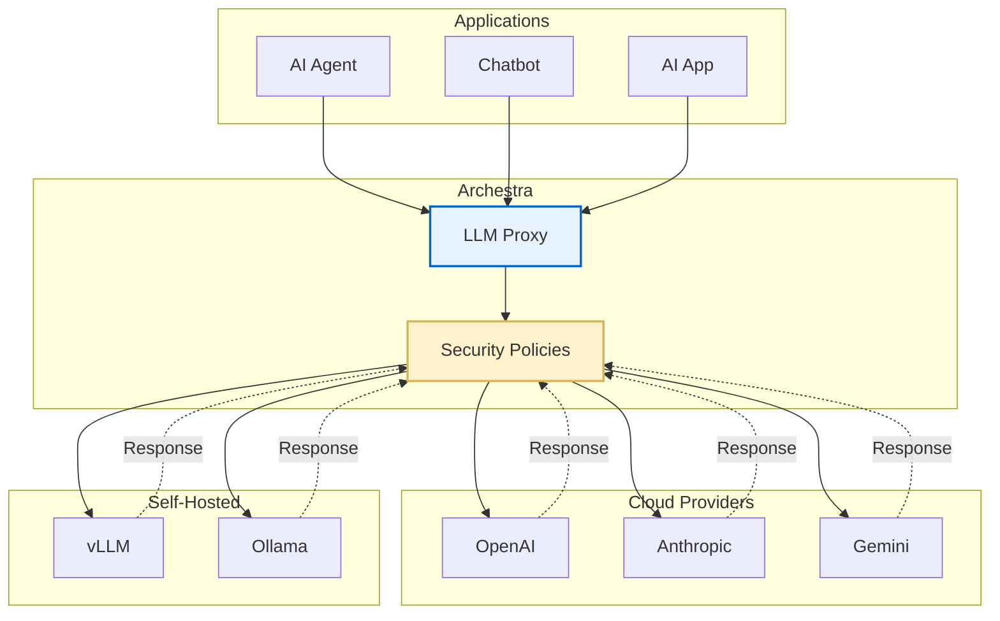

<!-- Renaming/deleting this file? Add a redirect in docs/redirects.json. -->

LLM Proxy is Archestra's security layer that sits between AI agents and LLM providers (OpenAI, Anthropic, Google, etc.). It intercepts, analyzes, and modifies LLM requests and responses to enforce security policies, prevent data leakage, and ensure compliance with organizational guidelines.

## To use LLM Proxy

1. Go to **LLM Proxy** in the sidebar.
2. On the **LLM Proxy** page, choose the LLM provider you are using. Copy the provided URL — `https://<your-archestra-host>/v1/<provider>`.
3. Use this URL when calling your LLM provider instead of the provider's original endpoint.

Use **Virtual Keys** in the sidebar to manage virtual API keys. Go to **Settings → OAuth Clients** to manage LLM OAuth clients. See [Authentication](/docs/platform-llm-proxy-authentication) for when to use each.



## Authentication

The LLM Proxy supports direct provider API keys, standard and passthrough virtual keys, LLM OAuth client access tokens, and JWKS via an external identity provider. See [Authentication](/docs/platform-llm-proxy-authentication) for details.

## OpenAI-Compatible Model Router

Use the model router when an application supports OpenAI-style APIs but you want to reach models from multiple configured providers through one endpoint.

```bash
curl -X POST "https://your-archestra-instance/v1/model-router/responses" \
  -H "Authorization: Bearer $MODEL_ROUTER_KEY_OR_APP_TOKEN" \
  -H "Content-Type: application/json" \
  -d '{
    "model": "openai:gpt-5.4",
    "input": "Hello!"
  }'
```

The router accepts OpenAI Responses and Chat Completions requests, resolves provider-qualified model IDs like `openai:gpt-5.4` to the backing provider, runs the normal LLM Proxy security pipeline, and returns the matching OpenAI-format response. Generic OpenAI-compatible clients should use a virtual key mapped to the providers they need. Backend services and bots should use an LLM OAuth client access token. See [Authentication](/docs/platform-llm-proxy-authentication) for setup and [Supported LLM Providers](/docs/platform-supported-llm-providers#openai-compatible-model-router) for model ID details.

## Custom Headers

Archestra supports the following custom headers on LLM Proxy requests. All headers are optional.

| Header                     | Description                                                                                                                                                                                                                                          | Example Value                          |
| -------------------------- | ---------------------------------------------------------------------------------------------------------------------------------------------------------------------------------------------------------------------------------------------------- | -------------------------------------- |
| `X-Archestra-Agent-Id`     | Identifier for the calling agent or application. Stored with each interaction and included in [trace attributes](/docs/platform-observability#distributed-tracing) as `archestra.external_agent_id`. Client-provided when set; if absent, Archestra auto-discovers known clients — Claude (recorded as `anthropic_claude`), Codex (recorded as `openai_codex`), and Cursor (recorded as `cursor`). Use it to tell apart the applications sharing the LLM Proxy.                       | `my-chatbot-prod`                      |
| `X-Archestra-User-Id`      | Associates the request with a specific Archestra user. Automatically included when using the built-in Archestra Chat.                                                                                                                                | `123e4567-e89b-12d3-a456-426614174000` |
| `X-Archestra-Virtual-Key`  | Authenticates the acting Archestra user with a [passthrough virtual key](/docs/platform-llm-proxy-authentication#passthrough-virtual-keys) when the provider credential in `Authorization` is passed straight through. Unlike `X-Archestra-User-Id`, it is authenticated. | `arch_abc123def456...`                 |
| `X-Archestra-Session-Id`   | Groups related LLM requests into a session - included in [trace attributes](/docs/platform-observability#distributed-tracing) as `gen_ai.conversation.id`.                                                                                           | `session-abc-123`                      |
| `X-Archestra-Execution-Id` | Associates the request with a specific execution run. Used for the `agent_executions_total` Prometheus metric which counts unique executions. See [Observability](/docs/platform-observability).                                                     | `exec-run-456`                         |
| `X-Archestra-Meta`         | Composite header combining agent ID, execution ID, and session ID in one value. Format: `<agent-id>/<execution-id>/<session-id>`. Any segment can be empty. Individual headers take precedence over meta header values. Values must not contain `/`. | `my-agent/exec-123/session-456`        |

### Usage

```bash
curl -X POST "https://your-archestra-instance/v1/openai/chat/completions" \
  -H "Authorization: Bearer $OPENAI_API_KEY" \
  -H "X-Archestra-Agent-Id: my-chatbot-prod" \
  -H "X-Archestra-Session-Id: session-abc-123" \
  -H "Content-Type: application/json" \
  -d '{
    "model": "gpt-4",
    "messages": [{"role": "user", "content": "Hello!"}]
  }'
```

Or equivalently using the composite meta header:

```bash
curl -X POST "https://your-archestra-instance/v1/openai/chat/completions" \
  -H "Authorization: Bearer $OPENAI_API_KEY" \
  -H "X-Archestra-Meta: my-chatbot-prod//session-abc-123" \
  -H "Content-Type: application/json" \
  -d '{
    "model": "gpt-4",
    "messages": [{"role": "user", "content": "Hello!"}]
  }'
```

## Supported Providers

For the full list of supported LLM providers, see [Supported LLM Providers](/docs/platform-supported-llm-providers).
