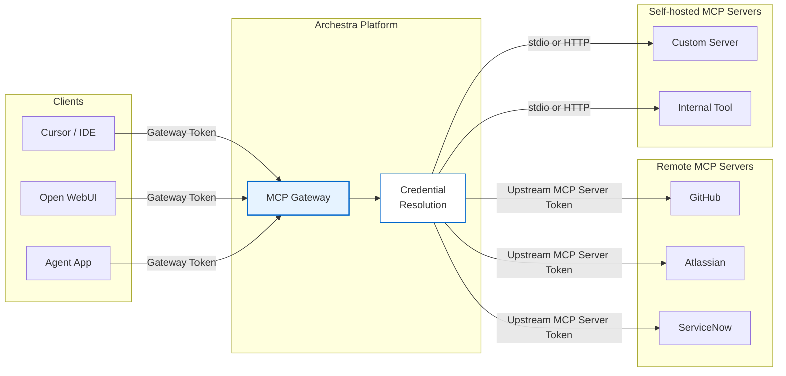

<!-- Renaming/deleting this file? Add a redirect in docs/redirects.json. -->

MCP Gateways are the MCP endpoints you expose to clients such as Cursor, Claude Desktop, Open WebUI, and custom agents. Each gateway presents a curated set of tools through one MCP endpoint, so clients do not need to connect to every MCP server directly.

Use separate gateways when different clients, teams, or environments need different tool sets or authentication rules. For example, one gateway might expose developer tools to an engineering team, while another exposes support tools to a customer operations agent.

## Gateway Model

A gateway is a named MCP surface. It has its own visibility, authentication settings, and assigned tools. The same installed MCP server can appear behind multiple gateways, but each gateway decides which clients can reach it and which tools are exposed.

Create gateways from **MCP Gateways** with the setup wizard. **Configuration** asks for the name and visibility, **Tools & Knowledge** picks what the gateway exposes, and **Advanced** holds labels, passthrough headers, and the identity provider. Nothing is saved until **Create** on the last step — the gateway then opens on its **Connect** tab, which shows how clients reach it. Every gateway has its own page with an **Overview** and a **Connect** tab; **Edit** reopens the wizard, where **Save** on any step returns to the Overview. A usable gateway needs:

- at least one assigned tool
- a supported client authentication path
- visibility that matches the users or teams that should call it

Tool assignments can point to a specific installed MCP server connection or use **Resolve at call time**. Resolve-at-call-time is useful when the same gateway should use the caller's own GitHub, Jira, or other upstream credential instead of a shared connection.

After the gateway is configured, use its **Connect** tab to copy connection details for supported clients.

## Tool Assignment

An admin picks each gateway tool explicitly. Each assignment can be pinned to a specific installed MCP server connection, or use **Resolve at call time** (see Gateway Model above).

Use explicit assignment when different clients need different subsets of the same installed MCP server, or when a gateway should use a shared service-account connection for some tools and caller-specific credentials for others.

A gateway shares the agent **Auto** / **Custom** **Tools & Knowledge Sources** control. Explicit assignment above is **Custom** mode; **Auto** mode lets `search_tools`/`run_tool` reach every tool the signed-in user can access (see [Load Tools When Needed](#load-tools-when-needed)). A gateway can also be assigned [knowledge sources](/docs/platform-knowledge#assigning-to-an-agent) under the same setting, giving it a `query_knowledge_sources` tool.

## Authentication

Gateway authentication and upstream MCP server authentication are separate. The client authenticates to Archestra first. When a tool runs, Archestra resolves the credential needed by that specific upstream MCP server.

MCP Gateways support four client authentication paths:

- **OAuth 2.1**: MCP-native clients authenticate through the [MCP Authorization spec](https://modelcontextprotocol.io/specification/2025-11-25/basic/authorization). Archestra supports Authorization Code + PKCE, DCR, CIMD, and standard well-known discovery.
- **ID-JAG**: Enterprise-managed MCP clients exchange an identity assertion JWT for an Archestra-issued MCP access token scoped to the gateway.
- **Identity Provider JWKS**: Clients send an external IdP JWT directly to the gateway. Archestra validates it against the IdP's JWKS and matches the caller to an Archestra user.
- **Bearer Token**: Direct integrations send `Authorization: Bearer arch_<token>`. Tokens can be scoped to a user, team, or organization.

Use OAuth 2.1 for standard MCP clients, ID-JAG or JWKS for enterprise-managed identity, and bearer tokens for direct service integrations or simple local setup.

See [MCP Authentication](/docs/mcp-authentication) for more details.

## Protocol Versions

Gateways serve both the `2025-11-25` and `2026-07-28` MCP revisions from the same endpoint. Clients pick one with the `MCP-Protocol-Version` header, or by sending `io.modelcontextprotocol/protocolVersion` in a request's `_meta`. A client that declares neither keeps the older behavior, so existing integrations need no change.

Older revisions still work too. Anything back to `2024-11-05` is accepted and served as `2025-11-25` would be — the gateway echoes back the version you asked for rather than upgrading you.

### What Each Revision Gets

| Feature | `2025-11-25` | `2026-07-28` |
| --- | --- | --- |
| Capability discovery | `initialize` handshake | `server/discover` |
| Session | `Mcp-Session-Id` header | None — every request stands alone |
| Routing headers | Not sent | `Mcp-Method` and `Mcp-Name` required |
| Interactive input | Elicitation during the call | Multi round-trip: the call returns what it needs, you retry with the answer |
| Result caching hints | Sent, ignored by older clients | `ttlMs` and `cacheScope` on tool, prompt, and resource results |
| Result envelope | Plain result | `resultType`, plus server identity in `_meta` |
| Missing-resource error | `-32002` | `-32602` |
| `ping` and `logging/setLevel` | Answered | Removed — method-not-found |
| Change notifications | None | `subscriptions/listen` stream for tool-list changes |
| `x-mcp-header` params | Ignored | Mirrored to `Mcp-Param-*` headers on upstream calls |
| Long-running tools | Call blocks until done | Tasks extension — slow calls return a handle to poll |

Both revisions see the same tools, the same access control, and the same policies. The differences are all in how a client talks to the gateway, not in what it can reach.

### Notes for Clients on `2026-07-28`

Routing headers must agree with the request body. The gateway rejects a mismatch — the headers exist so proxies can route without reading the body, so one that disagrees with its body is treated as a problem rather than ignored.

Tool, prompt, and resource results carry a freshness hint. It is always marked private: a gateway filters results per caller, so two users can legitimately see different ones and a shared cache must not serve one person's view to another.

A tool that needs input mid-call returns a request for it instead of prompting inline. Your client gathers the answer and retries the same call with it attached. The retry re-runs the tool, and the gateway caps how many times one call can go around.

To hear about tool-list changes, open a `subscriptions/listen` stream with `toolsListChanged` in the filter. The first event acknowledges which types the gateway honors — tool-list changes only, since prompt and resource lists come from upstream servers. Close the stream to unsubscribe.

### Long-Running Tools

Declare the Tasks extension (`io.modelcontextprotocol/tasks`) in a request's `_meta` capabilities and the gateway may answer a slow tool call with a task handle instead of blocking. Poll `tasks/get` with the handle until the task completes — the result is exactly what the blocking call would have returned. `tasks/cancel` stops a running task.

The gateway decides per call: anything that finishes within the threshold (10 seconds by default) returns normally. A client that never declares the extension always gets the blocking behavior. Tasks belong to the caller that started them — another caller's `tasks/get` finds nothing.

One limit to know: a tool that asks for interactive input after its call became a task fails with an explanatory error, since no one is connected to answer. Re-run the call without task mode to answer interactively.

## Published Skills

A gateway can also publish your organization's skills to connecting clients as `skill://` resources. The client reads them alongside its own. See [Publishing Skills over MCP](/docs/platform-mcp-gateway-skills).

## Access Control

Gateway access depends on both the caller and the gateway configuration. A user must be allowed to see the MCP Gateway, usually through organization visibility or team membership, and the gateway must have the specific tool assigned to it.

If a gateway is scoped to one team, members outside that team cannot use it even if the underlying MCP server exists in the registry. This lets admins approve MCP servers centrally while still exposing different tool sets to different teams or clients.

The reverse also holds: a caller with gateway access can call its assigned tools even when a tool's MCP server is not shared with them. The server's team assignment governs the registry, not tool calls. See [Agent Access vs MCP Server Access](/docs/platform-access-control#agent-access-vs-mcp-server-access).

See [Access Control](/docs/platform-access-control) for the permission model.

## Load Tools When Needed

By default, a gateway exposes every assigned tool through MCP `tools/list`.

For larger toolsets, turn on **Progressive tool loading** on the gateway's **Tools & Knowledge** step. This keeps the initial tool list small. Clients see the built-in [`search_tools`](/docs/platform-archestra-mcp-server#search_tools) and [`run_tool`](/docs/platform-archestra-mcp-server#run_tool) tools first.

Those two tools are enabled implicitly and do not appear in the built-in tool picker. The rest of the gateway's assigned tools stay available on demand:

- `search_tools` can discover them
- `run_tool` can execute them

Use this when the full tool list is too large or noisy to send to the model on every turn, but the gateway still needs the same underlying tool access.

With **Auto** tool mode also enabled, a signed-in user's `search_tools` and `run_tool` reach every MCP catalog tool and knowledge source that user can access. `tools/list` still returns only those two tools, however many the user can reach. Credentials resolve at call time per the MCP server's **Default credential** setting — on behalf of the user by default, or one shared account when the server is configured that way. Nothing is assigned to the gateway. Sessions authenticated with org or team tokens stay limited to assigned tools, and the org-wide **Dynamic Tool Access** security setting can disable the behavior entirely.

Tool call policies still apply to the target tool. `run_tool` does not bypass input conditions, team conditions, untrusted-context rules, or approval-required rules.

## Custom Headers

MCP Gateways can forward selected client request headers to downstream HTTP-based MCP servers. Use this for request-specific context such as correlation IDs, tenant IDs, or other application headers that need to reach the server handling the tool call.

Configure the allowlist in the gateway's **Advanced** section. Only headers on the allowlist are forwarded; all others are dropped. Header names are case-insensitive and stored in lowercase.

Gateway header passthrough does not override credentials managed by Archestra. If a forwarded header conflicts with an upstream credential header such as `Authorization`, the credential resolved by Archestra takes precedence.

Header passthrough applies to remote MCP servers and local MCP servers using streamable-http transport. Stdio-based servers do not support HTTP headers.

## Elicitation

MCP servers behind a gateway can use MCP elicitation to ask the connected client for more information during a tool call. Archestra passes these requests through only when the caller supports elicitation, so non-interactive clients are not asked to complete forms.

## Version History

Every configuration change to a gateway is kept as a version. Open **Version history** from the gateway's row to browse them. Read what changed, and restore an earlier one. Restoring creates a new version — the history is never rewritten. See [Version History](/docs/platform-agents#version-history).

## Environment

A gateway can be assigned a deployment environment. It then exposes and executes only tools (and knowledge) from the same environment — a "dev" gateway cannot reach "prod" servers. Built-in servers are always available. Unassigned gateways use the Default environment. See [Environments](/docs/platform-environments).
